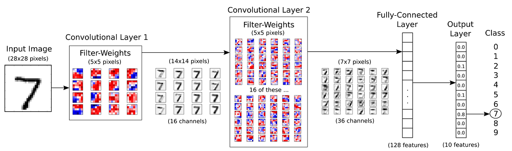
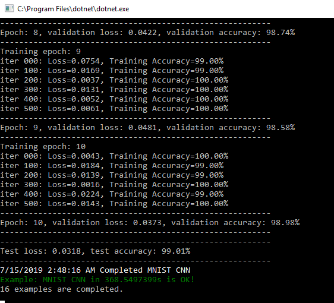

# Chapter. Convolution Neural Network

In this chapter, we'll implement a simple Convolutional Neural Network model. We'll implement this model to classify MNIST dataset.


The structure of the neural network we're going to build is as follows. The hand-written digits images of the MNIST data which has 10 classes (from 0 to 9). The network is with 2 convolutional layers followed by 2 full-connected layers at the end. 



Get started with the implementation:

1. **Prepare data**

   MNIST is dataset of handwritten digits which contains 55,000 examples for training, 5,000 examples for validation and 10,000 example for testing. The digits have been size-normalized and centered in a fixed-size image (28 x 28 pixels) with values from 0 and 1.Each image has been flattened and converted to a 1-D array of 784 features. It's also kind of benchmark of datasets for deep learning.

   

   We define some variables makes it easier to modify them later. 

   ```csharp
   using System;
   using NumSharp;
   using Tensorflow;
   using TensorFlowNET.Examples.Utility;
   using static Tensorflow.Python;
   ```

   ```csharp
   const int img_h = 28;
   const int img_w = 28;
   int n_classes = 10; // Number of classes, one class per digit
   int n_channels = 1;
   ```

   We'll write the function which automatically loads the MNIST data and returns it in our desired shape and format. There is an MNIST data helper to make life easier.

   ```csharp
   Datasets mnist;
   public void PrepareData()
   {
       mnist = MnistDataSet.read_data_sets("mnist", one_hot: true);
   }
   ```

   Other than a function for loading the images and corresponding labels, we still need three more functions:

   **reformat:** reformats the data to the format acceptable for convolutional layer.

   ```csharp
   private (NDArray, NDArray) Reformat(NDArray x, NDArray y)
   {
       var (img_size, num_ch, num_class) = (np.sqrt(x.shape[1]), 1, len(np.unique<int>(np.argmax(y, 1))));
       var dataset = x.reshape(x.shape[0], img_size, img_size, num_ch).astype(np.float32);
       //y[0] = np.arange(num_class) == y[0];
       //var labels = (np.arange(num_class) == y.reshape(y.shape[0], 1, y.shape[1])).astype(np.float32);
       return (dataset, y);
   }
   ```

   

   **randomize**: which randomizes the order of images and their labels. At the beginning of each epoch, we will re-randomize the order of data samples to make sure that the trained model is not sensitive to the order of data.

   ```csharp
   private (NDArray, NDArray) randomize(NDArray x, NDArray y)
   {
       var perm = np.random.permutation(y.shape[0]);
   
       np.random.shuffle(perm);
       return (mnist.train.images[perm], mnist.train.labels[perm]);
   }
   ```

   **get_next_batch**: which only selects a few number of images determined by the batch_size variable (as per Stochastic Gradient Descent method).

   ```csharp
   private (NDArray, NDArray) get_next_batch(NDArray x, NDArray y, int start, int end)
   {
       var x_batch = x[$"{start}:{end}"];
       var y_batch = y[$"{start}:{end}"];
       return (x_batch, y_batch);
   }
   ```

2. **Set Hyperparameters**

   There're about 55,000 images in training set, it takes a long time to calculate the gradient of the model using all there images. Therefore we use a small batch of images in each iteration of the optimizer by Stochastic Gradient Descent.

   * epoch: one forward pass and one backward pass of all the training examples.
   * batch size: the number of training examples in one forward/backward pass. The higher the batch size, the more memory space you'll need.
   * iteration: one forward pass and one backward pass of one batch of images the training examples.

   ```csharp
   int epochs = 10;
   int batch_size = 100;
   float learning_rate = 0.001f;
   int display_freq = 200; // Frequency of displaying the training results
   ```

3. **Network configuration**

   1st convolutional layer:

   ```csharp
   int filter_size1 = 5;  // Convolution filters are 5 x 5 pixels.
   int num_filters1 = 16; //  There are 16 of these filters.
   int stride1 = 1;  // The stride of the sliding window
   ```

   2nd convolutional layer:

   ```csharp
   int filter_size2 = 5; // Convolution filters are 5 x 5 pixels.
   int num_filters2 = 32;// There are 32 of these filters.
   int stride2 = 1;  // The stride of the sliding window
   ```

   Fully-connected layer:

   ```csharp
   h1 = 128  # Number of neurons in fully-connected layer.
   ```

   

4. **Building the neural network**

   Let's make some functions to help build computation graph. 

   **variables**: We need to define two variables `W` and `b` to construct our linear model. We use `Tensorflow Variables` of proper size and initialization to define them.

   ```csharp
   // Create a weight variable with appropriate initialization
   private RefVariable weight_variable(string name, int[] shape)
   {
       var initer = tf.truncated_normal_initializer(stddev: 0.01f);
       return tf.get_variable(name,
                              dtype: tf.float32,
                              shape: shape,
                              initializer: initer);
   }
   
   // Create a bias variable with appropriate initialization
   private RefVariable bias_variable(string name, int[] shape)
   {
       var initial = tf.constant(0f, shape: shape, dtype: tf.float32);
       return tf.get_variable(name,
                              dtype: tf.float32,
                              initializer: initial);
   }
   ```

   **2D convolution layer**: This layer creates a convolution kernel that is convolved with the layer input to produce a tensor of outputs. 

   ```csharp
   private Tensor conv_layer(Tensor x, int filter_size, int num_filters, int stride, string name)
   {
       return with(tf.variable_scope(name), delegate {
   
           var num_in_channel = x.shape[x.NDims - 1];
           var shape = new[] { filter_size, filter_size, num_in_channel, num_filters };
           var W = weight_variable("W", shape);
           // var tf.summary.histogram("weight", W);
           var b = bias_variable("b", new[] { num_filters });
           // tf.summary.histogram("bias", b);
           var layer = tf.nn.conv2d(x, W,
                                    strides: new[] { 1, stride, stride, 1 },
                                    padding: "SAME");
           layer += b;
           return tf.nn.relu(layer);
       });
   }
   ```

   **max-pooling layer**: Max pooling operation for temporal data.

   ```csharp
   private Tensor max_pool(Tensor x, int ksize, int stride, string name)
   {
       return tf.nn.max_pool(x,
                             ksize: new[] { 1, ksize, ksize, 1 },
                             strides: new[] { 1, stride, stride, 1 },
                             padding: "SAME",
                             name: name);
   }
   ```

   **flatten_layer**: Flattens the output of the convolutional layer to be fed into fully-connected layer.

   ```csharp
   private Tensor flatten_layer(Tensor layer)
   {
       return with(tf.variable_scope("Flatten_layer"), delegate
                   {
                       var layer_shape = layer.TensorShape;
                       var num_features = layer_shape[new Slice(1, 4)].Size;
                       var layer_flat = tf.reshape(layer, new[] { -1, num_features });
   
                       return layer_flat;
                   });
   }
   ```

   

   **fully-connected layer**: Neural network consists of stacks of fully-connected (dense) layers. Having the weight (W) and bias (b) variables, a fully-connected layer is defined as `activation(W x X + b)`. The complete `fc_layer` function is as below:

   ```csharp
   private Tensor fc_layer(Tensor x, int num_units, string name, bool use_relu = true)
   {
       return with(tf.variable_scope(name), delegate
                   {
                       var in_dim = x.shape[1];
   
                       var W = weight_variable("W_" + name, shape: new[] { in_dim, num_units });
                       var b = bias_variable("b_" + name, new[] { num_units });
   
                       var layer = tf.matmul(x, W) + b;
                       if (use_relu)
                           layer = tf.nn.relu(layer);
   
                       return layer;
                   });
   } 
   ```

   **inputs**: Now we need to define the proper tensors to feed in the input to our model. Placeholder variable is the suitable choice for the input images and corresponding labels. This allow us to change the inputs (images and labels) to the TensorFlow graph.

   ```csharp
   with(tf.name_scope("Input"), delegate
        {
            // Placeholders for inputs (x) and outputs(y)
            x = tf.placeholder(tf.float32, shape: (-1, img_h, img_w, n_channels), name: "X");
            y = tf.placeholder(tf.float32, shape: (-1, n_classes), name: "Y");
        });
   ```

   Placeholder `y` is the variable for the true labels associated with the images that were input in the placeholder variable `x`. It holds an arbitrary number of labels and each label is a vector of length `num_classes` which is 10.

   **network layers**: After creating the proper input, we have to pass it to our model. Since we have a neural network, we can stack multiple fully-connected layers using `fc_layer` method. Note that we will not use any activation function (use_relu = false) in the last layer. The reason is that we can use `tf.nn.softmax_cross_entropy_with_logits` to calculate the loss.

   ```csharp
   var conv1 = conv_layer(x, filter_size1, num_filters1, stride1, name: "conv1");
   var pool1 = max_pool(conv1, ksize: 2, stride: 2, name: "pool1");
   var conv2 = conv_layer(pool1, filter_size2, num_filters2, stride2, name: "conv2");
   var pool2 = max_pool(conv2, ksize: 2, stride: 2, name: "pool2");
   var layer_flat = flatten_layer(pool2);
   var fc1 = fc_layer(layer_flat, h1, "FC1", use_relu: true);
   var output_logits = fc_layer(fc1, n_classes, "OUT", use_relu: false);
   ```

   **loss function, optimizer, accuracy, prediction**: After creating the network, we have to calculate the loss and optimize it, we have to calculate the `prediction` and `accuracy`.

   ```csharp
   with(tf.variable_scope("Train"), delegate
        {
   
   
            with(tf.variable_scope("Optimizer"), delegate
                 {
                     optimizer = tf.train.AdamOptimizer(learning_rate: learning_rate, name: "Adam-op").minimize(loss);
                 });
   
            with(tf.variable_scope("Accuracy"), delegate
                 {
                     var correct_prediction = tf.equal(tf.argmax(output_logits, 1), tf.argmax(y, 1), name: "correct_pred");
                     accuracy = tf.reduce_mean(tf.cast(correct_prediction, tf.float32), name: "accuracy");
                 });
   
            with(tf.variable_scope("Prediction"), delegate
                 {
                     cls_prediction = tf.argmax(output_logits, axis: 1, name: "predictions");
                 });
        });
   ```
   
   **initialize variables**: We have to invoke a variable initializer operation to initialize all variables.
   
```csharp
   var init = tf.global_variables_initializer();
```

5. **Train**

   After creating the graph, we can train our model. To train the model, we have to create a session and run the graph in the session.

   ```csharp
   // Number of training iterations in each epoch
   var num_tr_iter = y_train.len / batch_size;
   
   var init = tf.global_variables_initializer();
   sess.run(init);
   
   float loss_val = 100.0f;
   float accuracy_val = 0f;
   
   foreach (var epoch in range(epochs))
   {
       print($"Training epoch: {epoch + 1}");
       // Randomly shuffle the training data at the beginning of each epoch 
       (x_train, y_train) = mnist.Randomize(x_train, y_train);
   
       foreach (var iteration in range(num_tr_iter))
       {
           var start = iteration * batch_size;
           var end = (iteration + 1) * batch_size;
           var (x_batch, y_batch) = mnist.GetNextBatch(x_train, y_train, start, end);
   
           // Run optimization op (backprop)
           sess.run(optimizer, new FeedItem(x, x_batch), new FeedItem(y, y_batch));
   
           if (iteration % display_freq == 0)
           {
               // Calculate and display the batch loss and accuracy
               var result = sess.run(new[] { loss, accuracy }, new FeedItem(x, x_batch), new FeedItem(y, y_batch));
               loss_val = result[0];
               accuracy_val = result[1];
               print($"iter {iteration.ToString("000")}: Loss={loss_val.ToString("0.0000")}, Training Accuracy={accuracy_val.ToString("P")}");
           }
       }
   
       // Run validation after every epoch
       var results1 = sess.run(new[] { loss, accuracy }, new FeedItem(x, x_valid), new FeedItem(y, y_valid));
       loss_val = results1[0];
       accuracy_val = results1[1];
       print("---------------------------------------------------------");
       print($"Epoch: {epoch + 1}, validation loss: {loss_val.ToString("0.0000")}, validation accuracy: {accuracy_val.ToString("P")}");
       print("---------------------------------------------------------");
   }
   ```
   
6. **Test**

   After the training is done, we have to test our model to see how good it performs on a new dataset. 

   ```csharp
   public void Test(Session sess)
   {
       var result = sess.run(new[] { loss, accuracy }, new FeedItem(x, x_test), new FeedItem(y, y_test));
       loss_test = result[0];
       accuracy_test = result[1];
       print("---------------------------------------------------------");
       print($"Test loss: {loss_test.ToString("0.0000")}, test accuracy: {accuracy_test.ToString("P")}");
    print("---------------------------------------------------------");
   }
   ```



