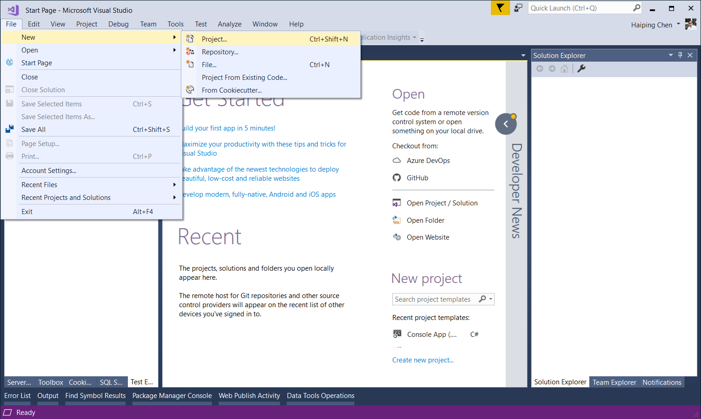
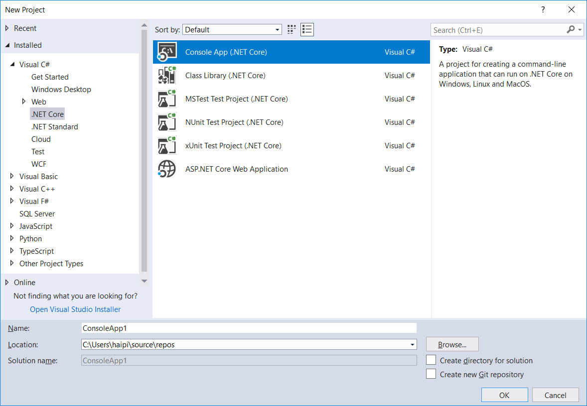

# 	Get started with TensorFlow.NET

I would describe TensorFlow as an open source machine learning framework developed by Google which can be used to build neural networks and perform a variety of machine learning tasks. it works on data flow graph where nodes are the mathematical operations and the edges are the data in the form of tensor, hence the name Tensor-Flow. 


Let's run a classic HelloWorld program first and see if TensorFlow is running on .NET. I can't think of a simpler way to be a HelloWorld.


### Install the TensorFlow.NET SDK

TensorFlow.NET uses the .NET Standard 2.0 standard, so your new project Target Framework can be .NET Framework or .NET Core/ .NET 5.  All the examples in this book are using .NET Core 3.1 and Microsoft Visual Studio Community 2019. To start building TensorFlow program you just need to download and install the .NET SDK (Software Development Kit). You have to download the latest .NET Core SDK from offical website: https://dotnet.microsoft.com/download.


1. New a project

   

2. Choose Console App (.NET Core)

   


```cmd
### install tensorflow C# binding
PM> Install-Package TensorFlow.NET

### Install tensorflow binary
### For CPU version
PM> Install-Package SciSharp.TensorFlow.Redist

### For GPU version (CUDA and cuDNN are required)
PM> Install-Package SciSharp.TensorFlow.Redist-Windows-GPU
```

### Start coding Hello World

After installing the TensorFlow.NET package, you can use the `using static Tensorflow.Binding` to introduce the TensorFlow .NET library.

TensorFlow 2.x enabled `Eager Mode` by default. About what eager mode is, I will introduce it in detail in the following chapters.

```csharp
using System;
using static Tensorflow.Binding;

namespace TensorFlowNET.Examples
{
    /// <summary>
    /// Simple hello world using TensorFlow
    /// </summary>
    class Program
    {
        static void Main(string[] args)
        {
            var hello = tf.constant("Hello, TensorFlow!");
            Console.WriteLine(hello);
        }
    }
}
```
After CTRL + F5 run, you will get the output.
```cmd
9/20/2020 2:15:09 AM Starting Hello World
tf.Tensor: shape=(), dtype=string, numpy=Hello, TensorFlow.NET!
9/20/2020 2:15:09 AM Completed Hello World
Example: Hello World in 0.1273463s is OK!
TensorFlow.NET v0.20.1.0
TensorFlow Binary v2.3.0
1 of 21 example(s) are completed.
Press [Enter] to continue...
```

This sample code can be found at [here](https://github.com/SciSharp/SciSharp-Stack-Examples/blob/master/src/TensorFlowNET.Examples/HelloWorld.cs).

