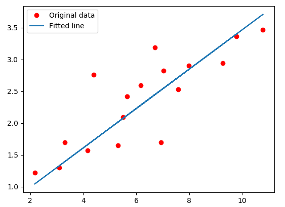
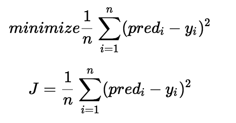
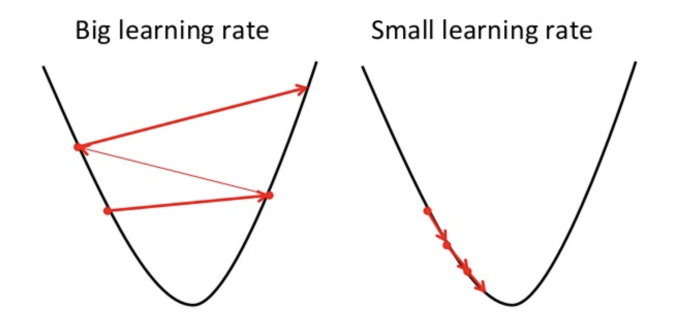
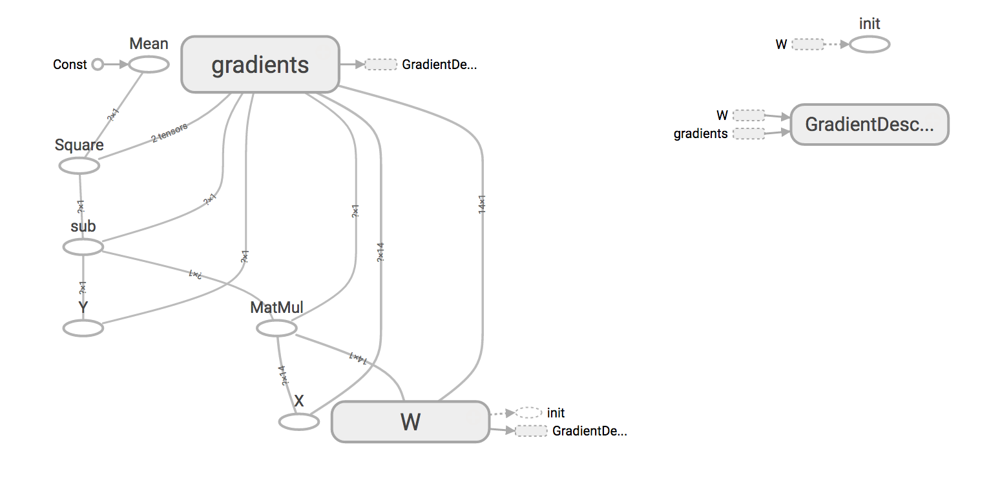

# Chapter. Linear Regression

### What is linear regression?

Linear regression is a linear approach to modelling the relationship between a scalar response (or dependent variable) and one or more explanatory variables (or independent variables). 

Consider the case of a single variable of interest y and a single predictor variable x. The predictor variables are called by many names: covariates, inputs, features; the predicted variable is often called response, output, outcome.

We have some data $D=\{x{\tiny i},y{\tiny i}\}$ and we assume a simple linear model of this dataset with Gaussian noise:

线性回归是一种线性建模方法，这种方法用来描述自变量与一个或多个因变量的之间的关系。在只有一个因变量y和一个自变量的情况下。自变量还有以下几种叫法：协变量，输入，特征；因变量通常被叫做响应变量，输出，输出结果。
假如我们有数据$D=\{x{\tiny i},y{\tiny i}\}$，并且假设这个数据集是满足高斯分布的线性模型：
```csharp
// Prepare training Data
var train_X = np.array(3.3f, 4.4f, 5.5f, 6.71f, 6.93f, 4.168f, 9.779f, 6.182f, 7.59f, 2.167f, 7.042f, 10.791f, 5.313f, 7.997f, 5.654f, 9.27f, 3.1f);
var train_Y = np.array(1.7f, 2.76f, 2.09f, 3.19f, 1.694f, 1.573f, 3.366f, 2.596f, 2.53f, 1.221f, 2.827f, 3.465f, 1.65f, 2.904f, 2.42f, 2.94f, 1.3f);
var n_samples = train_X.shape[0];
```


Based on the given data points, we try to plot a line that models the points the best. The red line can be modelled based on the linear equation: $y = wx + b$. The motive of the linear regression algorithm is to find the best values for $w$ and $b$. Before moving on to the algorithm, le's have a look at two important concepts you must know to better understand linear regression.

按照上图根据数据描述的数据点，在这些数据点之间画出一条线，这条线能达到最好模拟点的分布的效果。红色的线能够通过下面呢线性等式来描述：$y = wx + b$。线性回归算法的目标就是找到这条线对应的最好的参数$w$和$b$。在介绍线性回归算法之前，我们先看两个重要的概念，这两个概念有助于你理解线性回归算法。

### Cost Function

The cost function helps us to figure out the best possible values for $w$ and $b$ which would provide the best fit line for the data points. Since we want the best values for $w$ and $b$, we convert this search problem into a minimization problem where we would like to minimize the error between the predicted value and the actual value.



We choose the above function to minimize. The difference between the predicted values and ground truth measures the error difference. We square the error difference and sum over all data points and divide that
value by the total number of data points. This provides the average squared error over all the data points. Therefore, this cost function is also known as the Mean Squared Error(MSE) function. Now, using this MSE
function we are going to change the values of $w$ and $b$ such that the MSE value settles at the minima.

```csharp
// tf Graph Input
var X = tf.placeholder(tf.float32);
var Y = tf.placeholder(tf.float32);

// Set model weights 
var W = tf.Variable(rng.randn<float>(), name: "weight");
var b = tf.Variable(rng.randn<float>(), name: "bias");

// Construct a linear model
var pred = tf.add(tf.multiply(X, W), b);

// Mean squared error
var cost = tf.reduce_sum(tf.pow(pred - Y, 2.0f)) / (2.0f * n_samples);
```

### Gradient Descent

The another important concept needed to understand is gradient descent. Gradient descent is a method of updating $w$ and $b$ to minimize the cost function. The idea is that we start with some random values for $w$ and $b$ and then we change these values iteratively to reduce the cost. Gradient descent helps us on how to update the values or which direction we would go next. Gradient descent is also know as **steepest descent**.



To draw an analogy, imagine a pit in the shape of U and you are standing at the topmost point in the pit and your objective is to reach the bottom of the pit. There is a catch, you can only take a discrete number
of steps to reach the bottom. If you decide to take one step at a time you would eventually reach the bottom of the pit but this would take a longer time. If you choose to take longer steps each time, you would 
reach sooner but, there is a chance that you could overshoot the bottom of the pit and not exactly at the bottom. In the gradient descent algorithm, the number of steps you take is the learning rate. This 
decides on how fast the algorithm converges to the minima.

```csharp
// Gradient descent
// Note, minimize() knows to modify W and b because Variable objects are trainable=True by default
var optimizer = tf.train.GradientDescentOptimizer(learning_rate).minimize(cost);
```

When we visualize the graph in TensorBoard:



The full example is [here](https://github.com/SciSharp/TensorFlow.NET/blob/master/test/TensorFlowNET.Examples/LinearRegression.cs).
