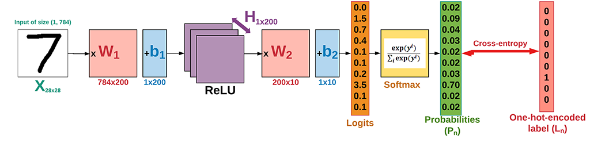
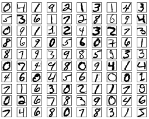
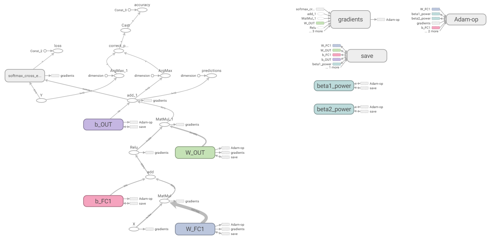
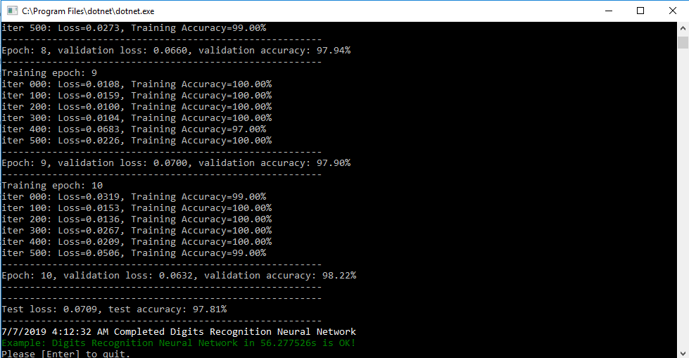

# Chapter. Neural Network

In this chapter, we'll learn how to build a graph of neural network model. The key advantage of neural network compared to Linear Classifier is that it can separate data which it not linearly separable. We'll implement this model to classify hand-written digits images from the MNIST dataset.


The structure of the neural network we're going to build is as follows. The hand-written digits images of the MNIST data which has 10 classes (from 0 to 9). The network is with 2 hidden layers: the first layer with 200 hidden units (neurons) and the second one (known as classifier layer) with 10 neurons. 



Get started with the implementation step by step:

1. **Prepare data**

   MNIST is dataset of handwritten digits which contains 55,000 examples for training, 5,000 examples for validation and 10,000 example for testing. The digits have been size-normalized and centered in a fixed-size image (28 x 28 pixels) with values from 0 and 1.Each image has been flattened and converted to a 1-D array of 784 features. It's also kind of benchmark of datasets for deep learning.

   

   We define some variables makes it easier to modify them later. It's important to note that in a linear model, we have to flatten the input images to a vector.

   ```csharp
   using System;
   using NumSharp;
   using Tensorflow;
   using TensorFlowNET.Examples.Utility;
   using static Tensorflow.Python;
   ```

   ```csharp
   const int img_h = 28;
   const int img_w = 28;
   int img_size_flat = img_h * img_w; // 784, the total number of pixels
   int n_classes = 10; // Number of classes, one class per digit
   ```

   We'll write the function which automatically loads the MNIST data and returns it in our desired shape and format. There is an MNIST data helper to make life easier.

   ```csharp
   Datasets mnist;
   public void PrepareData()
   {
       mnist = MnistDataSet.read_data_sets("mnist", one_hot: true);
   }
   ```

   Other than a function for loading the images and corresponding labels, we still need two more functions:

   **randomize**: which randomizes the order of images and their labels. At the beginning of each epoch, we will re-randomize the order of data samples to make sure that the trained model is not sensitive to the order of data.

   ```csharp
   private (NDArray, NDArray) randomize(NDArray x, NDArray y)
   {
       var perm = np.random.permutation(y.shape[0]);
   
       np.random.shuffle(perm);
       return (mnist.train.images[perm], mnist.train.labels[perm]);
   }
   ```

   **get_next_batch**: which only selects a few number of images determined by the batch_size variable (as per Stochastic Gradient Descent method).

   ```csharp
   private (NDArray, NDArray) get_next_batch(NDArray x, NDArray y, int start, int end)
   {
       var x_batch = x[$"{start}:{end}"];
       var y_batch = y[$"{start}:{end}"];
       return (x_batch, y_batch);
   }
   ```

2. **Set Hyperparameters**

   There're about 55,000 images in training set, it takes a long time to calculate the gradient of the model using all there images. Therefore we use a small batch of images in each iteration of the optimizer by Stochastic Gradient Descent.

   * epoch: one forward pass and one backward pass of all the training examples.
   * batch size: the number of training examples in one forward/backward pass. The higher the batch size, the more memory space you'll need.
   * iteration: one forward pass and one backward pass of one batch of images the training examples.

   ```csharp
   int epochs = 10;
   int batch_size = 100;
   float learning_rate = 0.001f;
   int h1 = 200; // number of nodes in the 1st hidden layer
   ```

3. **Building the neural network**
   
   Let's make some functions to help build computation graph. 
   
   **variables**: We need to define two variables `W` and `b` to construct our linear model. We use `Tensorflow Variables` of proper size and initialization to define them.
   
   ```csharp
   // weight_variable
   var in_dim = x.shape[1];
   
   var initer = tf.truncated_normal_initializer(stddev: 0.01f);
   var W = tf.get_variable("W_" + name,
                           dtype: tf.float32,
                           shape: (in_dim, num_units),
                           initializer: initer);
   
   // bias_variable
   var initial = tf.constant(0f, num_units);
   var b = tf.get_variable("b_" + name,
                           dtype: tf.float32,
                           initializer: initial);
   ```
   
   **fully-connected layer**: Neural network consists of stacks of fully-connected (dense) layers. Having the weight (W) and bias (b) variables, a fully-connected layer is defined as `activation(W x X + b)`. The complete `fc_layer` function is as below:
   
   ```csharp
   private Tensor fc_layer(Tensor x, int num_units, string name, bool use_relu = true)
   {
       var in_dim = x.shape[1];
   
       var initer = tf.truncated_normal_initializer(stddev: 0.01f);
       var W = tf.get_variable("W_" + name,
                               dtype: tf.float32,
                               shape: (in_dim, num_units),
                               initializer: initer);
   
       var initial = tf.constant(0f, num_units);
       var b = tf.get_variable("b_" + name,
                               dtype: tf.float32,
                               initializer: initial);
   
       var layer = tf.matmul(x, W) + b;
       if (use_relu)
           layer = tf.nn.relu(layer);
   
       return layer;
   } 
   ```
   
   **inputs**: Now we need to define the proper tensors to feed in the input to our model. Placeholder variable is the suitable choice for the input images and corresponding labels. This allow us to change the inputs (images and labels) to the TensorFlow graph.
   
   ```csharp
   // Placeholders for inputs (x) and outputs(y)
   x = tf.placeholder(tf.float32, shape: (-1, img_size_flat), name: "X");
   y = tf.placeholder(tf.float32, shape: (-1, n_classes), name: "Y");
   ```
   
   Placeholder `x` is defined for the images, the shape is set to `[None, img_size_flat]`, where `None` means that the tensor may hold an arbitrary number of images with each image being a vector of length `img_size_flat`.
   
   Placeholder `y` is the variable for the true labels associated with the images that were input in the placeholder variable `x`. It holds an arbitrary number of labels and each label is a vector of length `num_classes` which is 10.
   
   **network layers**: After creating the proper input, we have to pass it to our model. Since we have a neural network, we can stack multiple fully-connected layers using `fc_layer` method. Note that we will not use any activation function (use_relu = false) in the last layer. The reason is that we can use `tf.nn.softmax_cross_entropy_with_logits` to calculate the loss.
   
   ```csharp
   // Create a fully-connected layer with h1 nodes as hidden layer
   var fc1 = fc_layer(x, h1, "FC1", use_relu: true);
   // Create a fully-connected layer with n_classes nodes as output layer
   var output_logits = fc_layer(fc1, n_classes, "OUT", use_relu: false);
   ```
   
   **loss function**: After creating the network, we have to calculate the loss and optimize it, we have to calculate the `correct_prediction` and `accuracy`.
   
   ```csharp
   // Define the loss function, optimizer, and accuracy
   var logits = tf.nn.softmax_cross_entropy_with_logits(labels: y, logits: output_logits);
   loss = tf.reduce_mean(logits, name: "loss");
   optimizer = tf.train.AdamOptimizer(learning_rate: learning_rate, name: "Adam-op").minimize(loss);
   var correct_prediction = tf.equal(tf.argmax(output_logits, 1), tf.argmax(y, 1), name: "correct_pred");
   accuracy = tf.reduce_mean(tf.cast(correct_prediction, tf.float32), name: "accuracy");
   ```
   
   **initialize variables**: We have to invoke a variable initializer operation to initialize all variables.
   
   ```csharp
   var init = tf.global_variables_initializer();
   ```
   
   The complete computation graph is looks like below:
   
   
   
4. **Train**

   After creating the graph, we can train our model. To train the model, we have to create a session and run the graph in the session.

   ```csharp
   // Number of training iterations in each epoch
   var num_tr_iter = mnist.train.labels.len / batch_size;
   with(tf.Session(), sess =>
   {
       sess.run(init);
   
       float loss_val = 100.0f;
       float accuracy_val = 0f;
   
       foreach (var epoch in range(epochs))
       {
           print($"Training epoch: {epoch + 1}");
           // Randomly shuffle the training data at the beginning of each epoch 
           var (x_train, y_train) = randomize(mnist.train.images, mnist.train.labels);
   
           foreach (var iteration in range(num_tr_iter))
           {
               var start = iteration * batch_size;
               var end = (iteration + 1) * batch_size;
               var (x_batch, y_batch) = get_next_batch(x_train, y_train, start, end);
   
               // Run optimization op (backprop)
               sess.run(optimizer, new FeedItem(x, x_batch), new FeedItem(y, y_batch));
   
               if (iteration % display_freq == 0)
               {
                   // Calculate and display the batch loss and accuracy
                   var result = sess.run(new[] { loss, accuracy }, new FeedItem(x, x_batch), new FeedItem(y, y_batch));
                   loss_val = result[0];
                   accuracy_val = result[1];
                   print($"iter {iteration.ToString("000")}: Loss={loss_val.ToString("0.0000")}, Training Accuracy={accuracy_val.ToString("P")}");
               }
           }
   
           // Run validation after every epoch
           var results1 = sess.run(new[] { loss, accuracy }, new FeedItem(x, mnist.validation.images), new FeedItem(y, mnist.validation.labels));
           loss_val = results1[0];
           accuracy_val = results1[1];
           print("---------------------------------------------------------");
           print($"Epoch: {epoch + 1}, validation loss: {loss_val.ToString("0.0000")}, validation accuracy: {accuracy_val.ToString("P")}");
           print("---------------------------------------------------------");
       }
   });
   ```
   
5. **Test**

   After the training is done, we have to test our model to see how good it performs on a new dataset. 
   
   ```csharp
   var result = sess.run(new[] { loss, accuracy }, new FeedItem(x, mnist.test.images), 	new FeedItem(y, mnist.test.labels));
   loss_test = result[0];
   accuracy_test = result[1];
   print("---------------------------------------------------------");
   print($"Test loss: {loss_test.ToString("0.0000")}, test accuracy: {accuracy_test.ToString("P")}");
   print("---------------------------------------------------------");
   ```
   
   

   
   

