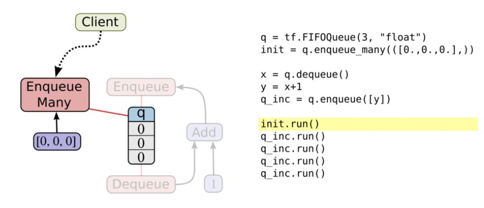

# Chapter. Queue

ThensorFlow is capable to handle multiple threads, and queues are powerful mechanism for asynchronous computation. If we have large datasets this can significantly speed up the training process of our models. This functionality is especially handy when reading, pre-processing and extracting in mini-batches our training data. The secret to being able to do professional and high performance training of our model is understanding TensorFlow queuing operations. TensorFlow has implemented 4 types of Queue: **FIFOQueue**, **PaddingFIFOQueue**, **PriorityQueue** and **RandomShuffleQueue**.



Like everything in TensorFlow, a queue is a node in a computation graph. It's a stateful node, like a variable: other nodes can modify its content, In particular, nodes can enqueue new items into the queue, or dequeue existing items from the queue. 

To get started with queue, let's consider a simple example. We will create a "first in, first out" queue (FIFOQueue) and fill it with numbers. Then we'll construct a graph that takes an item off the queue, adds one to that item, and puts it back on the end of the queue.

```csharp
[TestMethod]
public void FIFOQueue()
{
	// create a first in first out queue with capacity up to 2
	// and data type set as int32
	var queue = tf.FIFOQueue(2, tf.int32);
	// init queue, push 2 elements into queue.
	var init = queue.enqueue_many(new[] { 10, 20 });
	// pop out the first element
	var x = queue.dequeue();
	// add 1
	var y = x + 1;
	// push back into queue
	var inc = queue.enqueue(y);

	using (var sess = tf.Session())
	{
		// init queue
		init.run();

		// pop out first element and push back calculated y
		(int dequeued, _) = sess.run((x, inc));
		Assert.AreEqual(10, dequeued);

		(dequeued, _) = sess.run((x, inc));
		Assert.AreEqual(20, dequeued);

		(dequeued, _) = sess.run((x, inc));
		Assert.AreEqual(11, dequeued);

		(dequeued, _) = sess.run((x, inc));
		Assert.AreEqual(21, dequeued);
        
		// thread will hang or block if you run sess.run(x) again
		// until queue has more element.
	}
}
```

`Enqueue`, `EnqueueMany` and `Dequeue` are special nodes. They take a pointer to the queue instead of a normal value, allowing them to change it. I first create a FIFOQueue *queue* of size up to 3, I enqueue two values into the *queue*. Then I immediately attempt to *dequeue* a value from it and assign it to *y* where I simply add 1 to the dequeued variable. Next, we start up a *session* and run. After we've run this operation a few times the queue will be empty - if we try and run the operation again, the main thread of the program will hang or block - this is because it will be waiting for another operation to be run to put more values in the queue. 

#### FIFOQueue

Creates a queue that dequeues elements in a first-in first-out order. A `FIFOQueue` has bounded capacity; supports multiple concurrent producers and consumers; and provides exactly-once delivery. A `FIFOQueue` holds a list of up to `capacity` elements. Each element is a fixed-length tuple of tensors whose dtypes are described by `dtypes`, and whose shapes are optionally described by the `shapes` argument.

#### PaddingFIFOQueue

A FIFOQueue that supports batching variable-sized tensors by padding. A `PaddingFIFOQueue` may contain components with dynamic shape, while also supporting `dequeue_many`. A `PaddingFIFOQueue` holds a list of up to `capacity` elements. Each element is a fixed-length tuple of tensors whose dtypes are described by `dtypes`, and whose shapes are described by the `shapes` argument.

```chsarp
[TestMethod]
public void PaddingFIFOQueue()
{
	var numbers = tf.placeholder(tf.int32);
	var queue = tf.PaddingFIFOQueue(10, tf.int32, new TensorShape(-1));
	var enqueue = queue.enqueue(numbers);
	var dequeue_many = queue.dequeue_many(n: 3);

	using(var sess = tf.Session())
	{
		sess.run(enqueue, (numbers, new[] { 1 }));
		sess.run(enqueue, (numbers, new[] { 2, 3 }));
		sess.run(enqueue, (numbers, new[] { 3, 4, 5 }));

		var result = sess.run(dequeue_many[0]);

		Assert.IsTrue(Enumerable.SequenceEqual(new int[] { 1, 0, 0 }, result[0].ToArray<int>()));
		Assert.IsTrue(Enumerable.SequenceEqual(new int[] { 2, 3, 0 }, result[1].ToArray<int>()));
		Assert.IsTrue(Enumerable.SequenceEqual(new int[] { 3, 4, 5 }, result[2].ToArray<int>()));
	}
}
```


#### PriorityQueue

A queue implementation that dequeues elements in prioritized order. A `PriorityQueue` has bounded capacity; supports multiple concurrent producers and consumers; and provides exactly-once delivery. A `PriorityQueue` holds a list of up to `capacity` elements. Each element is a fixed-length tuple of tensors whose dtypes are described by `types`, and whose shapes are optionally described by the `shapes` argument.

```csharp
[TestMethod]
public void PriorityQueue()
{
	var queue = tf.PriorityQueue(3, tf.@string);
	var init = queue.enqueue_many(new[] { 2L, 4L, 3L }, new[] { "p1", "p2", "p3" });
	var x = queue.dequeue();

	using (var sess = tf.Session())
	{
		init.run();

		// output will 2, 3, 4
		var result = sess.run(x);
		Assert.AreEqual(result[0].GetInt64(), 2L);

		result = sess.run(x);
		Assert.AreEqual(result[0].GetInt64(), 3L);

		result = sess.run(x);
		Assert.AreEqual(result[0].GetInt64(), 4L);
	}
}
```


#### RandomShuffleQueue

A queue implementation that dequeues elements in a random order. A `RandomShuffleQueue` has bounded capacity; supports multiple concurrent producers and consumers; and provides exactly-once delivery. A `RandomShuffleQueue` holds a list of up to `capacity` elements. Each element is a fixed-length tuple of tensors whose dtypes are described by `dtypes`, and whose shapes are optionally described by the `shapes` argument.

```csharp
[TestMethod]
public void RandomShuffleQueue()
{
	var queue = tf.RandomShuffleQueue(10, min_after_dequeue: 1, dtype: tf.int32);
	var init = queue.enqueue_many(new[] { 1, 2, 3, 4, 5, 6, 7, 8, 9, 10 });
	var x = queue.dequeue();

	string results = "";
	using (var sess = tf.Session())
	{
		init.run();

		foreach(var i in range(9))
			results += (int)sess.run(x) + ".";

		// output in random order
		// 1.2.3.4.5.6.7.8.9.
	}
}
```


Queue methods must run on the same device as the queue. `FIFOQueue` and `RandomShuffleQueue` are important TensorFlow objects for computing tensor asynchronously in a graph. For example, a typical input architecture is to use a `RandomShuffleQueue` to prepare inputs for training a model:

* Multiple threads prepare training examples and push them in the queue.
* A training thread executes a training op that dequeues mini-batches from the queue.

This architecture simplifies the construction of input pipelines. 


From the above example, once the output gets to the point above you’ll actually have to terminate the program as it is blocked. Now, this isn’t very useful. What we really want to happen is for our little program to reload or enqueue more values whenever our queue is empty or is about to become empty.  We could fix this by explicitly running our *enqueue_op* again in the code above to reload our queue with values.  However, for large, more realistic programs, this will become unwieldy.  Thankfully, TensorFlow has a solution.

TensorFlow provides two classes to help multi-threading task: `tf.Coordinator` and `tf.QueueRunner`. There two classes are designed to be used together. The `Coordinator` class helps multiple threads stop together and report exceptions to a main thread. The `QueueRunner` class is used to create a number of threads cooperating to enqueue tensors in the same queue.
